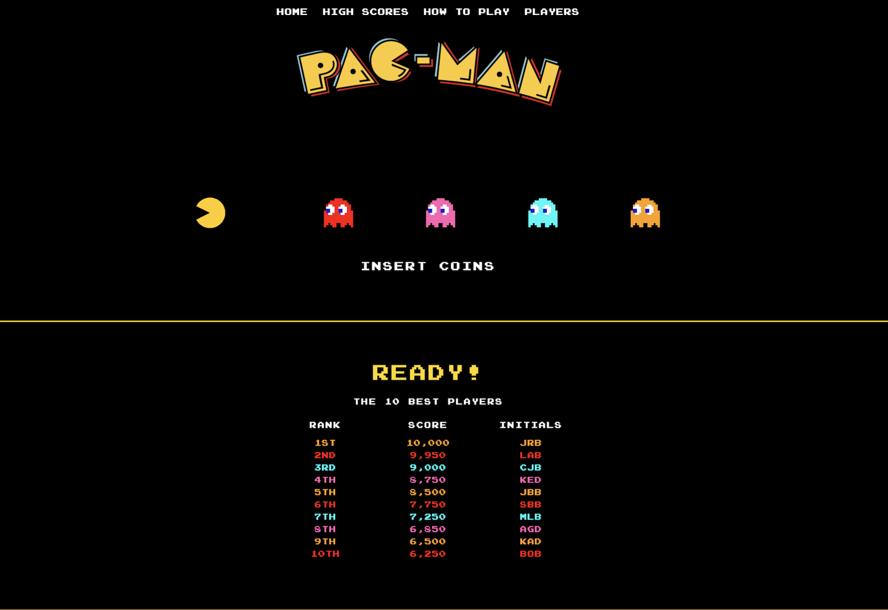

# Francesca Arduini

**Graphic Design Student | Creative & Detail-Oriented**

### [My Github Profile](https://github.com/Fard25/resume)
---

## About Me

Creative and reliable Graphic Design student with a strong interest in visual communication, branding, and creative problem-solving. Experienced in customer service, teamwork, and working in fast-paced environments. Organized, adaptable, and eager to develop professional design experience.

---

## Project

---

## Education

### Humber Polytechnic | Etobicoke, Ontario
**Graphic Design – Advanced Diploma**  
September 2025 – Present

- Developing skills in visual communication, typography, layout, and design
- Building creative projects through hands-on design assignments

---

## Experience

### Canadian Tire
**Cashier | 2026 – Present**

- Provide friendly and professional customer service
- Process transactions accurately in a fast-paced environment
- Communicate effectively with customers and team members
- Maintain an organized and welcoming checkout area

### Vaughan Soccer Club
**Soccer Coach | July 2021 – July 2025**

- Created and organized visual and activity-based drills
- Communicated instructions clearly to players
- Developed teamwork and leadership skills
- Planned activities while adapting to different skill levels

---

## Community Experience

### Down Syndrome Association of York Region
**Volunteer | 2019 – Present**

- Assisted with planning and organizing community events
- Designed and decorated raffle prizes
- Helped create welcoming and organized event displays
- Assisted with registration and guest communication

---

## Skills

- Visual Communication
- Typography & Layout
- Adobe Photoshop
- Adobe Illustrator
- Figma
- Creative Problem-Solving
- Attention to Detail

---

## Extracurricular

### Humber Women's Soccer Team
**Soccer Player | September 2025 – Present**

### Vaughan Soccer Club
**Soccer Player | 2012 – August 2026**

- Developed leadership, teamwork, and communication skills
- Worked effectively under pressure
- Built strong time management and problem-solving skills

---

## Achievements

**All-Rookie Team**, Humber Women's Varsity Soccer | 2025
**Honour Roll**, Humber Polytechnic | 2025
**Most Sportsmanship Player Award**, Varsity Soccer | 2024

---

## References

Available upon request
